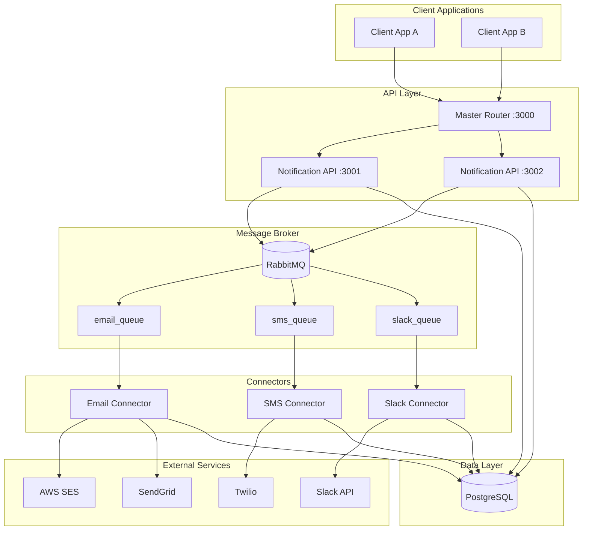
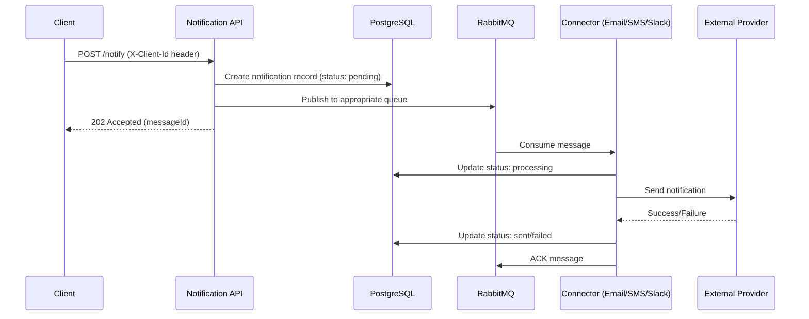
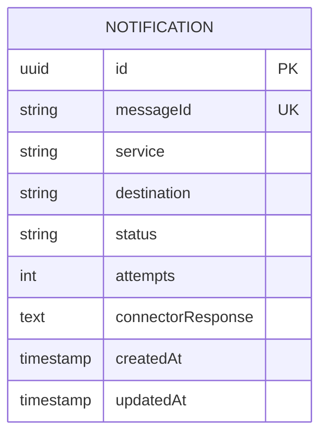
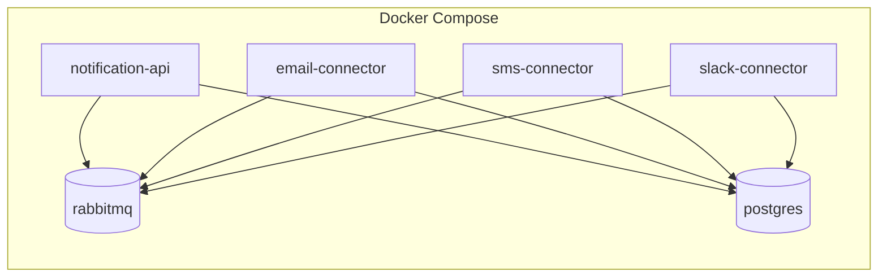

# Universal Notification System - High-Level Design (HLD)

## 1. Overview

A microservices-based notification system that enables multi-tenant applications to send notifications via Email, SMS, and Slack channels through a unified API.

---

## 2. System Architecture



---

## 3. Components

### 3.1 Notification API
| Aspect | Details |
|--------|---------|
| **Purpose** | REST API for receiving notification requests |
| **Port** | 3000 (Master Router), 3001+ (Worker APIs) |
| **Scaling** | Cluster-based with 1 worker per unique port |
| **Key Files** | `server.js`, `app.js`, `rabbitMQClient.js` |

### 3.2 Email Connector
| Aspect | Details |
|--------|---------|
| **Purpose** | Consumes email queue and delivers via configured provider |
| **Providers** | AWS SES, SendGrid, Mailgun, Gmail, SMTP |
| **Key Files** | `rabbitMQClient.js`, `emailSender.js`, `connectionManager.js` |

### 3.3 SMS Connector
| Aspect | Details |
|--------|---------|
| **Purpose** | Consumes SMS queue and delivers via configured provider |
| **Providers** | Twilio, AWS SNS, Custom SMS gateways |
| **Key Files** | `rabbitMQClient.js`, `smsSender.js`, `connectionManager.js` |

### 3.4 Slack Connector
| Aspect | Details |
|--------|---------|
| **Purpose** | Consumes Slack queue and posts messages via Slack API |
| **Providers** | Slack Web API |
| **Key Files** | `rabbitMQClient.js`, `slackSender.js`, `connector.js` |

---

## 4. Data Flow



---

## 5. Multi-Tenancy

| Feature | Implementation |
|---------|----------------|
| **Client Identification** | `X-Client-Id` HTTP header |
| **Configuration** | `clientList.json` per service |
| **Database Isolation** | Schema-per-tenant (client_id.toLowerCase()) |
| **Connection Pooling** | LRU Cache per client (max 50, 1hr TTL) |
| **Worker Assignment** | Workers grouped by SERVER_PORT |

---

## 6. Message Queue Design

| Queue | Exchange | Routing Key | Consumer |
|-------|----------|-------------|----------|
| `email_queue` | `notifications_exchange` | `email` | Email Connector |
| `sms_queue` | `notifications_exchange` | `sms` | SMS Connector |
| `slack_queue` | `notifications_exchange` | `slack` | Slack Connector |

**Message Schema:**
```json
{
  "clientId": "GKMIT",
  "messageId": "uuid",
  "service": "email|sms|slack",
  "destination": "recipient",
  "content": {
    "subject": "...",
    "body": "...",
    "message": "..."
  }
}
```

---

## 7. Database Schema



**Status Values:** `pending` → `processing` → `sent` | `failed`

---

## 8. Scalability & Reliability

| Concern | Solution |
|---------|----------|
| **Horizontal Scaling** | Cluster workers per port, stateless connectors |
| **Message Durability** | Durable queues, persistent messages |
| **Idempotency** | Row-level locking on messageId, status checks |
| **Retry Logic** | Max attempts config, exponential backoff |
| **Graceful Shutdown** | SIGTERM/SIGINT handlers, connection cleanup |
| **Auto-Recovery** | Worker restart on exit, RabbitMQ reconnection |

---

## 9. Technology Stack

| Layer | Technology |
|-------|------------|
| Runtime | Node.js |
| API Framework | Express.js |
| Message Broker | RabbitMQ (amqplib) |
| Database | PostgreSQL (Sequelize ORM) |
| Caching | LRU Cache (in-memory) |
| Logging | Winston |
| Containerization | Docker, Docker Compose |

---

## 10. Deployment Architecture



---

## 11. Security Considerations

- API keys stored in environment variables
- Credentials not logged (token snippets only)
- Schema-level database isolation
- Per-client configuration validation
